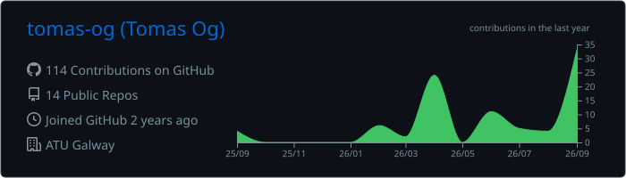
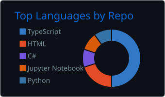

<h1 align="center">Tomás Óg Mac Donncha</h1>
<h3 align="center">Software developer · Galway, Ireland</h3>

<p align="center">
  
</p>

---

### `> about`

Final-year BSc (Hons) Computing in Software Development student at **ATU Galway**. I enjoy building software, solving problems, and learning new technologies, with a particular interest in **AI, web development, and software engineering**.

### `> status`

```yaml
graduating:  2027
looking_for: Graduate software developer role
interests:   AI, web development, front-end, back-end clean UI
based_in:    Galway, Ireland
```

### `> stack`

<table>
  <tr>
    <td><b>Web</b></td>
    <td></td>
  </tr>
  <tr>
    <td><b>Languages</b></td>
    <td></td>
  </tr>
  <tr>
    <td><b>Backend & Data</b></td>
    <td></td>
  </tr>
  <tr>
    <td><b>Game Dev</b></td>
    <td></td>
  </tr>
  <tr>
    <td><b>Design & Tools</b></td>
    <td></td>
  </tr>
</table>

### `> selected_work`

| Project | What it is | Stack |
| --- | --- | --- |
| **[JOGGO AR](https://github.com/JamesN05/Ctrl-A-Ctrl-C-Ctrl-V)** | AR app for smart glasses that aids people with memory loss | Unity, Firebase, Google AR |
| **[K9 Design](https://github.com/tomas-og/K9Design_V1)** | Website for a local dog grooming business | HTML, CSS, JavaScript |
| **[TaskMaxxing](https://github.com/JamesN05/Year-3-Prof-Prac-IT-Project)** | Habit-tracking app that uses social features to keep users accountable | Expo, React Native, Firebase Auth, AsyncStorage |

### `> stats`

<p align="center">
  
  
</p>

### `> contact`

<p align="center">
  Open to graduate roles and interesting projects. Get in touch.
</p>

<p align="center">
  <a href="mailto:g00435846@atu.ie"></a>
  <a href="https://linkedin.com/in/tomasogxyz"></a>
  <a href="https://github.com/tomas-og"></a>
</p>
